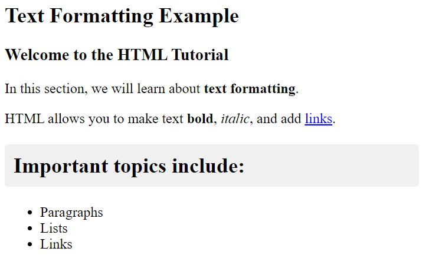
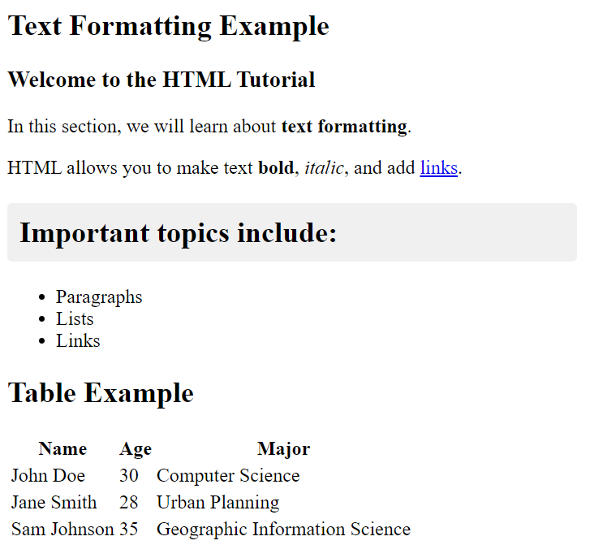
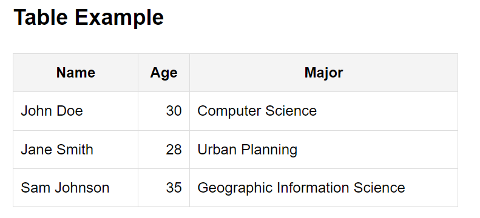
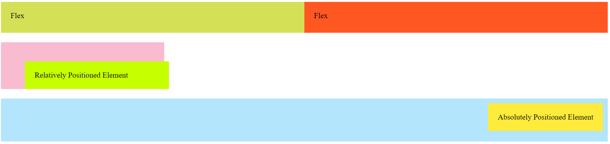
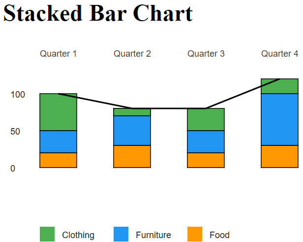

# Lab 1

##  Learning Objectives

This lab will introduce the fundamental concepts of HTML, CSS, and SVG. It consists of four parts, each including a tutorial and related activities. The tutorials provide the knowledge needed to complete the programming tasks for the activities. By the end of this lab, you will be able to:

- Use web development tools (Visual Studio Code/Sublime and Chrome)
- Set up and modify HTML documents
- Define CSS rules to style a web page
- Create and style SVG element

## Prerequisites

- Integrated Developer Environment installed on your laptop ([Visual Studio Code](https://code.visualstudio.com/) or [Sublime](https://www.sublimetext.com/3))
- Web Browser installed on your laptop (Google Chrome recommended)
- Download the lab1 zip folder from Canvas 
- You have read Chapter 3 in [D3 - Interactive Data Visualization for the Web](http://alignedleft.com/work/d3-book-2e) by Scott Murray (stop at the Javascript section)

### Useful Tutorial Videos

- [Chrome Web Inspector](https://www.youtube.com/watch?v=9-Ky3baMrYI)
- [HTML For Beginners](https://www.youtube.com/watch?v=UB1O30fR-EE)
- [CSS For Beginners](https://www.youtube.com/watch?v=yfoY53QXEnI)
- [SVG For Beginners](https://www.youtube.com/watch?v=IM8eTD01UE8)

### What to submit

- Zip up your entire `lab1` folder, name it `LastName_FirstName_lab1.zip` and submit it to Canvas.
- You should have completed Activity 1, Activity 2, Activity 3, and Activity 4 (in each respective subfolder).

### Grading

Your assignment will be graded on the following requirements:

- Created all 4 visuals
- Design of the charts matches the description
- Did not use additional visualization libraries other than what is specified
- Your final HTML pages render according to the description

### Running Code Locally
- Approach 1

  Simply double click the html file, this should open it with your default Web Browser such as Google Chrome. 

- Approach 2

  To view HTML files in a web browser, you can use Python's built-in HTTP server. Follow the steps below to run your code locally:

  1. Open your terminal or command prompt and use the `cd` command to navigate to the directory where your project files are located.
  2. Once you’re in your project directory, run the following command to start the server:
      ```bash
      python3 -m http.server 8080
  3. After running the command, your local server will be available at http://localhost:8080
  4. You can stop the server by running Ctrl + C in your terminal.
  5. If you are running into issues where the webpage is not reloading after making changes try CTRL+SHIFT+R on Windows or CMD+SHIFT+R on Mac. If the issue persists, reach out to us on Piazza!

# Part 1: Introduction to HTML

## Tutorial
## 1. Overview of HTML

HTML (HyperText Markup Language) is the standard markup language used to create web pages. It structures the content on the web, allowing you to format text, add images, create links, and more.

### Key Concepts

- **HTML**: The language used to structure a webpage.
- **DOM (Document Object Model)**: A representation of the page structure that allows programming languages (like JavaScript) to interact with HTML elements.
- **Tags**: The basic building blocks of HTML. Examples include `<p>`, `<a>`, `<div>`, and `<h1>`.
- **Attributes**: Additional information provided inside a tag. Examples include `href` for links and `src` for images.
- **Classes**: Used to apply CSS styles to multiple elements.
- **IDs**: Unique identifiers for elements, used to apply styles or reference them in scripts.

## 2. Basic HTML Structure

A simple HTML document has the following structure:

```html
<!DOCTYPE html>
<html lang="en">
  <head>
    <meta charset="UTF-8" />
    <meta name="viewport" content="width=device-width, initial-scale=1.0" />
    <title>Basic HTML Structure</title>
    <link rel="stylesheet" href="styles.css" />
  </head>
  <body>
    <!-- Content goes here -->
  </body>
</html>
```

**<h2 style="color: orange;"> To Do: Activity 1: Formatting Text and Adding a Table (2.5 points)**</h2>

**<h3 style="color: orange;"> **To Do: Activity 1a Formatting text (1 point):**</h3>**

In this activity, you will use HTML tags to format a paragraph of text.

Take the following paragraph as an example:

    Welcome to the HTML tutorial.
    In this section, we will learn about text formatting.
    HTML allows you to make text bold, italic, and add links.
    Important topics include:
    - Paragraphs
    - Lists
    - Links

Open \lab1\activity_1_and_2\index.html in your code editor (e.g., Visual Studio). Apply the appropriate tags to achieve the following formatting:



Grading Rubric: Your grade will be based on font style, the inclusion of necessary hyperlinks, and the presence of bullet points. The exact font size will not affect your grade, and you can choose your own colors.
### Using Tables

In HTML, tables are created using tags that define rows and columns. The fundamental HTML tags for building a table are:

- `<table>`: Defines the table.
- `<tr>`: Defines a table row.
- `<th>`: Defines a table header cell.
- `<td>`: Defines a table data cell.


**<h3 style="color: orange;"> To Do: Activity 1b Using Tables in HTML (1.5 points) <h3>**

Open \lab1\activity_1_and_2\index.html in your code editor (e.g., Visual Studio). Use the proper tags to add the following tables to your html:


| Name         | Age | Major                           |
|--------------|-----|---------------------------------|
| John Doe     |  30 | Computer Science                |
| Jane Smith   |  28 | Urban Planning                  |
| Sam Johnson  |  35 | Geographic Information Science  |


Your activity_1_format_table.html should look like this after you've completed Activity 1.1 and Activity 1.2:




# Part 2: Introduction to CSS

## Tutorial
## 1. Introduction to CSS

CSS (Cascading Style Sheets) is a stylesheet language used to describe the presentation of a document written in HTML. It controls the layout, colors, fonts, and overall design of a webpage. CSS allows you to separate content from design, making it easier to maintain and update the look and feel of your site.

### Key Concepts

- **Selectors**: Identify which HTML elements to style.
- **Properties and Values**: Define the styles to be applied.
- **Inline Styles**: Apply styles directly within HTML elements.
- **External Stylesheets**: Use separate CSS files to manage styles.

After completing this activity, students will be able to:

- Apply CSS rules to style HTML tables
- Understand and use CSS selectors (element, class, and ID selectors)
- Implement basic CSS properties for text alignment, borders, and background colors

## 2. Selectors

Selectors are patterns used to select the elements you want to style.

### Common Selectors

- **Element Selector**

  - Targets all instances of a specific HTML element.
  - **Syntax**: `element { property: value; }`
  - **Example**:
    ```css
    p {
      color: blue;
    }
    ```
    This will apply a blue text color to all `<p>` elements.

- **Class Selector**

  - Targets elements with a specific `class` attribute.
  - **Syntax**: `.class { property: value; }`
  - **Example**:
    ```css
    .highlight {
      background-color: yellow;
    }
    ```
    This will apply a yellow background to all elements with the `highlight` class.

- **ID Selector**

  - Targets a unique element with a specific `id` attribute.
  - **Syntax**: `#id { property: value; }`
  - **Example**:
    ```css
    #header {
      font-size: 24px;
    }
    ```
    This will apply a font size of 24px to the element with the `id` of `header`.

- **Attribute Selector**
  - Targets elements with a specific attribute.
  - **Syntax**: `[attribute="value"] { property: value; }`
  - **Example**:
    ```css
    [type="text"] {
      border: 1px solid #ccc;
    }
    ```
    This will apply a border to all `<input>` elements with `type="text"`.

#### Understanding CSS Specificity

CSS specificity determines which styles are applied when multiple rules target the same element. It's calculated based on the selector's components:

1. [Inline styles](#4-inline-styles) (highest specificity)
2. IDs
3. Classes, attributes, and pseudo-classes
4. Elements (lowest specificity)

The more specific a selector, the higher its priority. For example:

- `#header` (ID selector) overrides `.header` (class selector)
- `.header.active` (two classes) overrides `.header` (one class)
- `body header` (two elements) overrides `header` (one element)

If two selectors have equal specificity, the one defined last in the stylesheet takes precedence. Understanding specificity helps you write more predictable CSS.

## 3. Properties and Values

CSS properties define the style of an element, and values specify the settings for those properties.

### Common Properties and Values

- **Color**

  - **Property**: `color`
  - **Values**: `blue`, `#00f`, `rgb(0, 0, 255)`
  - **Example**:
    ```css
    p {
      color: #333;
    }
    ```

- **Font Size**

  - **Property**: `font-size`
  - **Values**: `16px`, `1em`, `120%`
  - **Example**:
    ```css
    h1 {
      font-size: 2em;
    }
    ```

- **Background Color**

  - **Property**: `background-color`
  - **Values**: `red`, `#f00`, `rgba(255, 0, 0, 0.5)`
  - **Example**:
    ```css
    .container {
      background-color: #f4f4f4;
    }
    ```

- **Margin and Padding**
  - **Properties**: `margin`, `padding`
  - **Values**: `10px`, `1em`, `5%`
  - **Example**:
    ```css
    .box {
      margin: 20px;
      padding: 10px;
    }
    ```

## 4. Inline Styles

Inline styles are CSS styles applied directly within an HTML element using the `style` attribute.

### Syntax

```html
<tagname style="property: value; property: value;"></tagname>
```

## 5. Referencing an external stylesheet from the HTML

A stylesheet is often stored in an external CSS file. Inside the CSS file are a list of CSS rules. To apply the CSS rules to your HTML elements, you need to include a line of code inside the <head></head> elements of your HTML file. For example, if your stylesheet is named `style.css`, you will need to include the following line inside <head></head>.

    <link rel="stylesheet" href="style.css">

**<h2 style="color: orange;"> To Do: Activity 2: Styling HTML Elements Using CSS (2 points) </h2>**

In this activity, you will use CSS rules to style the table you created in Activity 1.

Open \lab1\activity_1_and_2\style.css, add or modify attribute values in this file, and apply the corresponding class or ID names to your elements in index.html to achieve the following effects for your table:

- Right-align numbers, left-align text, and center the table (column) headers.
- Add borders to the table cells.
- Apply a shaded color to the table headers. You can choose your own color. 




Grading Rubric: Your grade will be based on your implementation of the three points mentioned above. You won't be graded on other aspects like text font size, column widths, or color choices.

Exploration: Now that you've styled your table according to the instructions, experiment with different colors, border styles, and font properties to customize your table further. Try changing the `background-color` of alternating rows, adjust the `font-family` of the header, or add a `box-shadow` to make your table stand out.

# Part 3: CSS Layout and Positioning Guide

## Tutorial
## 1. Inline Block

### Explanation

- `inline-block` is a CSS display property that allows elements to flow alongside other elements horizontally while maintaining block-level properties such as width and height.
- It combines characteristics of both `inline` and `block` display types.

### Usage

- Useful for creating layouts where elements need to align horizontally but also have control over their dimensions.
- Elements with `inline-block` do not force line breaks and can be aligned next to other inline or inline-block elements.

## 2. Flexbox

### Explanation

Flexbox is a CSS layout model designed to distribute space along a container’s main axis and align items along the cross axis. It provides powerful tools for creating responsive and adaptive layouts.

### Key Properties

- `display: flex;`: Defines a flex container.
- `justify-content`: Aligns flex items along the main axis (e.g., `center`, `space-between`).
- `align-items`: Aligns flex items along the cross axis (e.g., `flex-start`, `center`).
- `flex`: Defines how flex items grow or shrink relative to each other.

## 3. Relative Positioning

### Explanation

Relative positioning allows an element to be positioned relative to its normal position in the document flow. It does not remove the element from the document flow, meaning the space it originally occupied is preserved.

### Key Properties

- `top`, `right`, `bottom`, `left`: Adjust the element’s position from its original location.

## 4. Absolute Positioning

### Explanation

Absolute positioning removes an element from the document flow and positions it relative to its nearest positioned ancestor (i.e., an ancestor with `relative`, `absolute`, or `fixed` positioning). If no positioned ancestor exists, it is positioned relative to the initial containing block.

### Key Properties

- `top`, `right`, `bottom`, `left`: Define the exact position within the nearest positioned ancestor.

## 5. `div` Flows and Arrangement Rules

### Explanation

A `div` is a block-level element by default, meaning it starts on a new line and takes up the full width available. `div` elements flow vertically in the document, stacking on top of each other unless otherwise specified.

### Key Layout Techniques

- **Float**: Use `float` to wrap text around images or to align elements horizontally.
- **Flexbox/Grid**: Utilize Flexbox or CSS Grid for complex and responsive layouts.

**<h2 style="color: orange;"> To Do: Activity 3: Layout Arrangement Using CSS (2 points) </h2>**

In this task, you'll apply the positioning techniques discussed above to achieve the desired element arrangement effects. Open \lab1\activity_3\index.html and update the CSS styles present in the HTML to implement the three types of positioning: flexbox, relative positioning, and absolute positioning.



Grading Rubric: You will be graded based on your choice of CSS attributes and values to achieve the desired effect. The exact offset of the elements will not affect your grade.
 

# Part 4: SVG

## Tutorial
## 1. Introduction to SVG

SVG (Scalable Vector Graphics) is a markup language for describing two-dimensional vector graphics. It uses XML to define shapeSVG
s, paths, and other graphical elements that are scalable and interactive.

### Attributes

- **`width`** and **`height`**: Define the size of the SVG canvas.
- **`fill`**: Specifies the color inside a shape.
- **`stroke`**: Sets the color of the outline.
- **`transform`**: Allows scaling, rotating, and translating elements.

### Drawing Basic Shapes

- **Circle**: `<circle cx="50" cy="50" r="40" />`
- **Line**: `<line x1="0" y1="0" x2="100" y2="100" />`
- **Rectangle**: `<rect x="20" y="20" width="200" height="100" />`
- **Path**: `<path d="M10 80 C 40 10, 65 10, 95 80 S 150 150, 180 80" />`
- **Text**: `<text x="50" y="50" font-family="Arial" font-size="24" fill="black">Hello</text>`

### Transformations

- **Scale**: `<g transform="scale(1.5)">`
- **Rotate**: `<g transform="rotate(45, 50, 50)">`
- **Translate**: `<g transform="translate(50, 100)">`
- **Grouping**: Use `<g>` to group multiple elements and apply transformations.

**<h2 style="color: orange;"> To Do: Activity 4 Create a Stacked Bar Chart (3.5 points) </h2>**

Open \lab1\activity_4\index.html, edit the html body to create a stacked bar chart with a trend line using a dataset that shows quarterly profits from various departments:

- Use the x-axis to represent each quarter.
- The height of each bar should reflect the total profits for each department in that quarter. Ensure the bottoms of the stacked bars are aligned horizontally.
- Include a legend with rectangles and labels to indicate the colors corresponding to each department.

Hint: On the SVG canvas, the origin (0, 0) is located at the top left corner.

<h3 style="color: orange;"> Extra 0.5 Points: </h3>
Add a line connecting the top centers of the bars to illustrate the profit trend over the quarters.

Dataset:
| Category | Q1 Profit (k$) | Q2 Profit (k$) | Q3 Profit (k$) | Q4 Profit (k$) |
|-------------------|---------------|---------------|---------------|---------------|
| Furniture | 30 | 50 | 40 | 70 |
| Clothing | 50 | 10 | 30 | 20 |
| Food | 20 | 30 | 20 | 30 |

Your final results should look something like this:




 Grade Rubric: Your grade will be based on whether the bar heights proportionally represent the numeric values, if the bottoms of the bars are horizontally aligned, if you include a legend, and if you add the necessary labels to the axes and legend. You will have freedom in the following areas, which will not affect your grade: choosing your own color schemes, adjusting the bar widths proportionally, adding more or less space between bars, and determining the exact positions of labels and legends.

<h2 style="color: #fb6a4a;"> Checklist for Implementation and Submission: </h2>

1. I have updated `lab1\activity_1_and_2\index.html` to format the paragraph and add a table.
2. I have modified `lab1\activity_1_and_2\style.css` and `lab1\activity_1_and_2\index.html` to apply styles to the table. I saved my .css and my .html.
3. I have adjusted the CSS styles in `lab1\activity_3\index.html` to position elements so what when I run it, I see graphics that look like the example.
4. I added my code / edited `lab1\activity_4\index.html` so that it renders a stacked bar chart using SVG.
5. I have these editted files in the folders and zipped the lab 1 folder (lastname.zip). I uploaded my .zip folder to Canvas under Lab 1 assignment.


