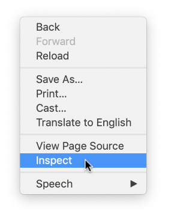
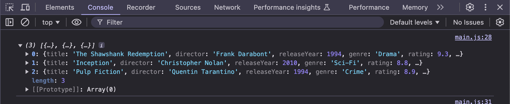
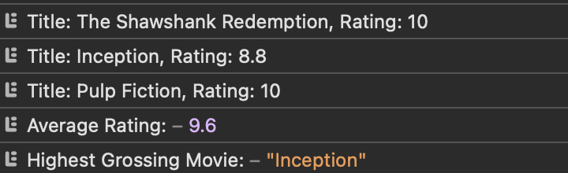
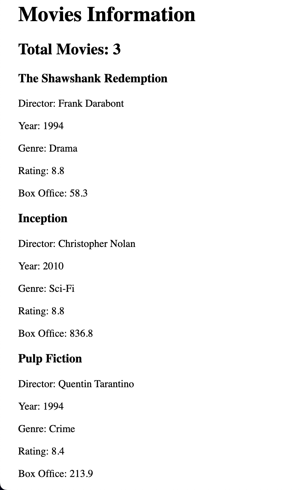
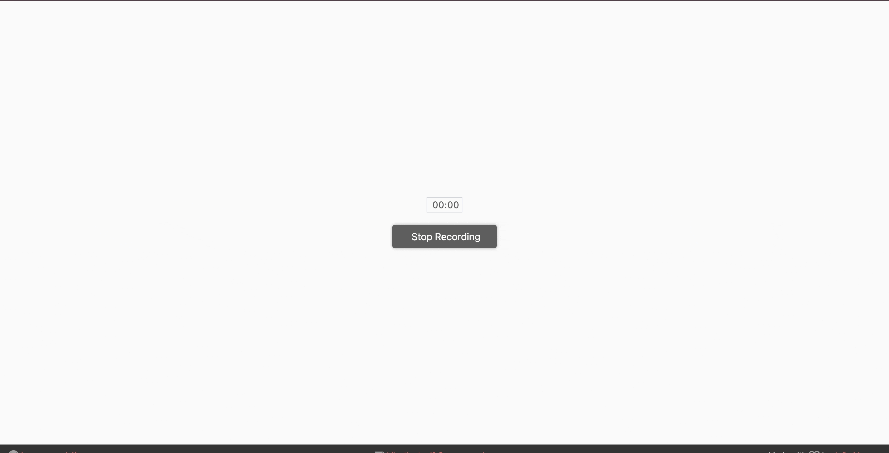

### Learning Objectives

After completing this lab you will be able to:
* Understand the basic concepts of JavaScript
	* Variables
	* Data Structures (Arrays, Objects)
	* Control Structures & Loops
	* Functions
	* Dynamic typing
* Include and run JavaScript code in your websites
* Debug your JavaScript code using the Web Console
* Manipulate the DOM with JavaScript code
* Understand and create JSON

### Prerequisites

* Download the corresponding lab from the code repo (either using git, or downloading the folder) from the code of this repo (in the Code tab above)
* You have read Chapter 3 in [D3 - Interactive Data Visualization for the Web](http://alignedleft.com/work/d3-book-2e) by Scott Murray (only the JavaScript section)

### Recommended Reading

* [JavaScript For Cats: An introduction for new programmers](http://jsforcats.com/) by M. Ogden
* [JavaScript, The Very Basics](https://cscheid.net/courses/spr15/cs444/lectures/week3.html) by C. Scheidegger from U of Arizona

### Additional Reading

* [JavaScript Fundamentals](http://dataviscourse.net/2015/lectures/lecture-javascript/) by A. Lex from U of Utah
* [MDN JavaScript Guide](https://developer.mozilla.org/en-US/docs/Web/JavaScript/Guide)
* [w3 schools JavaScript tutorials](https://www.w3schools.com/js/)
* [JavaScript: The Good Parts (book)](https://www.amazon.com/JavaScript-Good-Parts-Douglas-Crockford/dp/0596517742#) by D. Crockford

### Helpful Videos

* [Introduction to JavaScript from CodeAcademy](https://www.codecademy.com/learn/introduction-to-javascript)
* [JavaScript Basics from Udacity](https://www.udacity.com/course/javascript-basics--ud804)

### What to submit

* Zip up your entire `lab2` folder, name it `LastName_FirstName_lab2.zip` and submit it to Gradescope.
* You should have completed Activity 1, Activity 2, and Activity 3 (in each respective subfolder).  

### Grading

Your assignment will be graded on the following requirements:
* Completed the javascript activities listed.
* Shown through screenshots that the data structures exist in the browser
* Your final HTML pages render according to the description
* Correct functionality of the visualization in Activity 3

## Tutorial 1: Introduction to JavaScript

This week, we learn the basics of JavaScript, and start by making simple programs that animate simple things with it. Later in the course, we’ll use D3 because of its power and expressivity. But all that D3 does is use these APIs for you, and it is important that you understand at some level how D3 works.

The introduction below is not meant to give you a comprehensive description of JavaScript, but rather a foothold. Once you become proficient in the language, then you can start worrying about best practices and special cases, especially as they related to performance and portability across browsers. It’s easier for you simply not to worry about that kind of stuff right now.

JavaScript is the most important programming language of the web, and the only programming language that can be used on most web-browsers without any plugins. JavaScript is mostly used on the client-side of a client-server application, other languages such as `Java` and `Python` are popular on the server, but JavaScript is nowadays also used on the server e.g., using `Node.js`. We will be focusing on the client-side in this class.

JavaScript can be used with imperative/procedural, object-oriented, and functional programming styles. It is a *dynamically typed language*, which can be strange for developers who mainly work with strongly typed languages such as `C/C++` and `Java`. Also, Javascript uses *prototypical inheritance* instead of a *class-based model* for it’s object oriented purposes. That means that there is no `Class` that is defined centrally, instead you rely on objects’ prototypes for inheritance that can be extended at runtime. If this doesn’t mean much to you now, don’t worry - we’ll go through it slowly.

### A short rundown of the basic concepts of JavaScript

#### Variables
	// -- global variables --
	a = 0; // an integer stored as number
	b = "1"; // a string
	c = [1, 2, "3", [4]]; // an array
	f = false; // a boolean
	f = 34.56; // redefining f as a float stored as a number

	// -- "local" variables --
	var name = "Tom";
	var age = 21;

    // -- modern variable declarations --
    let score = 100;
    const PI = 3.14159;
	
The first thing to notice is that JavaScript’s variables are *dynamically typed*: you don’t need to declare their types before using them, and they can refer to values of different types at different times in the program execution. (This is convenient but quite error-prone: it’s usually a bad idea to make too much use of this feature.)

You also do not need to declare a variable ahead of time. If you don’t, then JavaScript either assumes you’re referring to an already existing variable, or it creates a new global variable. Again, this is convenient but very error-prone (this is a theme, as you’ll see). One common source of confusion is that typos in variable assignments are not caught: they just become global variables.

To create a local variable, you can use the keywords var, let, or const:

	var x = 0;
    let y = 1;
    const z = 2;

`var`: This is the traditional way to declare variables in JavaScript. Variables declared with `var` are function-scoped or globally-scoped. They can be redeclared and updated.
`let`: Introduced in ES6, `let` allows you to declare block-scoped variables. Unlike `var`, a variable declared with `let` can only be used within the block it's declared in. It can be updated but not redeclared in the same scope.
`const`: Also introduced in ES6, const is used to declare variables that won't be reassigned. Like `let`, it's block-scoped. Variables declared with `const` must be initialized at the time of declaration and can't be reassigned. However, for objects and arrays declared with `const`, their properties or elements can still be modified.

In modern JavaScript, it's generally recommended to use `const` by default, and only use `let` if you know the value of the variable will change. This helps prevent accidental reassignments and makes your code's intent clearer. The use of `var` is discouraged in modern JavaScript due to its function scope and ability to be redeclared, which can lead to unexpected behavior.

#### Data structures

The above described basic data types and variables are the foundation for all other data structures. A JavaScript variable is quite flexible as we have just seen, but very often we need to store a sequence of values
or more complex forms of data.

**Arrays**

Array literals are declared and addressed by using bracket notation `[]`
Each value is separated by a comma. Arrays can contain any type of data, just like simple variables.

	var c = [0,1,2];
	var e = []; // empty array declaration

	// you can but should not use arrays of different type
	var multiTypeArray = [0, "This", "is", true, "unfortunately"];
	
	// you can access the length of the array using the length attribute
	var myLength = multiTypeArray.length;
	
	// you can nest arrays
	var nested = [[1, 2], [3, 4], [5, 6]];
	
	// extend arrays
	c.push(3);
	var newLength = c.push(4);
	// remove last element from array
	var lastElement = c.pop();

	// find index of entry:
	var pos = c.indexOf(2);

**Objects**

Objects are the second type of compound values in JavaScript.

	obj = { key1: 3, key2: 4 };

There are two ways to access elements in an object. For example, to retrieve the first element in the above object, we can use `obj.key1` or `obj["key1"]`. So, both `obj.key1 + obj.key2` and `obj["key1"] + obj["key2"]` will give you the same result which is 7.

Furthermore, you can extend objects dynamically.

	obj.newKey = 5;

After running the above line, `newKey` will be added to `obj`:

	obj = { key1: 3, key2: 4, newKey: 5 };

**JSON (JavaScript Object Notation)**

JSON is a specific syntax for storing and exchanging data. It is a popular data-interchange format for APIs (application program interfaces) and therefore very important for our future tasks. It is basically a JavaScript object, with the only difference being that the property names are surrounded by double quotation marks.

	// JSON object
	var student = {
		"id": "1",
		"name": "Matt Ryan",
		"courses": ["CS 4460", "CS 3220", "PSYC 1010", "CS 3780"],
		"active": true
	}

**Dictionaries in JavaScript**

In JavaScript, dictionaries are typically implemented using objects. While JavaScript doesn't have a built-in dictionary data type, objects serve the same purpose and are often referred to as dictionaries or associative arrays.

	// Creating a dictionary
	let dict = {
		"apple": "A fruit",
		"car": "A vehicle",
		"book": "A reading material"
	};

	// Accessing values
	console.log(dict["apple"]); // Output: A fruit
	console.log(dict.car);      // Output: A vehicle

	// Adding new key-value pairs
	dict["computer"] = "An electronic device";
	dict.phone = "A communication device";

	// Modifying existing values
	dict["book"] = "A written or printed work";

	// Checking if a key exists
	if ("apple" in dict) {
		console.log("Apple is in the dictionary");
	}

	// Removing a key-value pair
	delete dict.car;

	// Iterating over the dictionary
	for (let key in dict) {
		console.log(key + ": " + dict[key]);
	}

**Destructuring**

Destructuring provides an easy way to extract values from arrays or properties from objects:

    // Array destructuring
    let [a, b] = [1, 2];
    console.log(a); // 1
    console.log(b); // 2

    // Object destructuring
    let {name, id} = student;
    console.log(name); // "Matt Ryan"
    console.log(id); // "1"

## Activity 1: Using the Web Console in Chrome (1.5 Points)

The Web Console in Chrome is extremely useful for debugging. Using `console.log()`, you can output the values of variables to the Web Console. In this activity, you will learn how to use it.

##### 1. Design a data structure

Find a proper compound JavaScript data structure to store the following information and make sure that its values are simple and efficient:

We want to create data for 3 of your favorite movies. Create a data structure and use it to populate data for 3 movies, each with these attributes:

* `title` (e.g., "Inception")
* `director` (e.g., "Christopher Nolan")
* `releaseYear` (e.g., 2010)
* `genre` (e.g., "Sci-Fi")
* `rating` (out of 10, e.g., 8.8)
* `boxOffice` (in millions of dollars, e.g., 836.8)

Which JavaScript data structures (arrays, objects, etc.) / data types (strings, numbers, etc.) would you use to represent the data? Once you know how you want to implement it, continue to step (2).

##### 2. Implement data structure in JavaScript

Scripts can be included directly in HTML or in a separate file with `.js` suffix and then referenced. We have already created `lab2/activity_1/main.js` and referenced it in `lab2/activity_1/index.html`. Reminder that referencing a javascript file is done by including the following in the html document:

		...
		// Referenced (below of the <body> tag)
		</body>
		
	</html>

In this exercise, open `lab2/activity_1/main.js` with your code editor. Create an `array` of the example data (3 Movies as `objects`, with the above described attributes) and implement it in `main.js`.

##### 3. Write messages to the Web Console

If you have stored your movies in a variable named `movieList`, use `console.log(movieList)` within the `main.js` file to print your movies.

Now, open `lab2/activity_1/index.html` in Chrome. To see the `console.log()` output, you will need to open the Web Inspector. You can do so using either method:
1. Inspect element by right-clicking anywhere on the page and select `Inspect`.
2. You can also open the Web Inspector with hot keys (for Chrome `⌘ + Shift + C` on Mac and `Ctrl + Shift + C` on Windows, for Firefox `⌘ + Opt + C` on Mac and `Ctrl + Shift + C` on Windows).

After opening the Web Inspector, switch to the Web Console tab and you will see the `console.log()` output.

> **Reload Page** The webpage may auto-refresh after an edit is made and saved (`cmd+S` or `ctrl+S`) in your IDE. Refreshing the page manually works most of the time. Use `cmd+shift+R` or `ctrl+shift+R` to hard refresh a page you suspect is not refreshing properly.

At this point, take a few screenshots of your Web Console tab. These screenshots should show your data structure. Expand a few of the objects (using the nested list expansion on the left side). Add these image files into your `lab2\activity_1` folder to zip up and upload later.

Grading: Your grade will be based on your movieList data structure and if you correctly logged your movieList to the Web Console.

## Tutorial 2: Control structures & loops

You should already be familiar with control structures, loops and functions. The following is just a short summary of these basic concepts. If you have programmed only in C, C++, Java etc. before, you should familiarize yourself with the slightly different syntax.

#### Control structures
	// The familiar if-statement
	if (1 == parseFloat("1")) {
    	console.log("First if");
	} else if (2 == parseFloat("3")) {
    	console.log("Else if");
	} else {
    	console.log("else");
	}

	// The ternary if operator
	// CONDITION ? WHAT_HAPPENS_IF_CONDITION_TRUE : WHAT_HAPPENS_IF_CONDITION_FALSE
	4%2 == 0 ? console.log(true) : console.log(false);

	// Switch statements
	var c = "some case";
	switch (c) {
    	case "string literals ok":
        	console.log("Yes");
        	break;
    	case "some case":
        	console.log("Unlike C");
        	break;
    	default:
        	console.log("Default");
    }

#### Loops

	// for loops
	var output = "";
	for (i = 0; i < 10; ++i) {
    	output += i + ", ";
	}
	console.log("For loop: " + output);

	// while loops;
	var i = 3;
	output = "";
	while (i < 100) {
    	output += i + ", ";
    	i = i * 2;
	}
	console.log("While loop: " + output);

	// Alternative, object oriented loop for arrays "forEach"
	var skills = ["JavaScript", "d3.js", "HTML", "CSS"];
	skills.forEach(function(element, index) {
		console.log(index + ": " + element);
	});

    // Similarly, we can use a for...of loop to iterate over the skills array
    for (const skill of skills) {
        // 'skill' is the loop variable that takes on the value of each element in the array
        // on each iteration
        
        // Log the current skill to the console
        console.log(skill);
        
        // The loop will automatically move to the next element after each iteration
    }
	
The `forEach` loop uses a concept called *anonymous functions*. An anonymous function is a function without a name. Instead of being declared with a name, it's typically created inline and assigned to a variable or passed as an argument to another function. Here's the basic syntax of an anonymous function:

    function() {
        // function body
    }

Anonymous functions are often used in JavaScript for callback functions and for assigning functions to variables.

#### Functions

**Basic Function Declaration**

Functions are one of the key features in computer science and are common to almost all programming languages. JavaScript uses function both the way we know them from languages such as C or Java, but also allows anonymous functions.

	function someFunction(v) {
    	if (v < 10) {
        	return v;
    	} else {
        	return v*v;
    	}
	}

	// this is how you should use this function
	console.log("Function for 30: " + someFunction(30));
	console.log("Function for -5: " + someFunction(-5));

	// But, as usual, JavaScript lets you do strange things that are convenient sometimes, and confusing at other times:
	console.log("Function for string: " + someFunction("what?"));
	console.log("Function with more parameters: " + someFunction(30, "huh?"));
	
None of the calls above cause runtime errors. If you call a function with too many parameters, JavaScript will simply ignore the extra ones. If you call a function with too few parameters, JavaScript gives the local parameters the special value undefined.

**Function Scope**

	function anotherFunction(v2) {
		// x and y only available inside this scope { }
    	var x = v2 * 10;
    	var y = v2 / 2;
    	return x * y;
	}
	var returnedValue = anotherFunction(4);
	
	console.log("Returned value: " + returnedValue + "; x or y however, are not defined in this scope. \n Calling x or y would result in an error.");
	
**Function Expressions**

	var variableFunction = function(v) {
    	if (v > 10) {
        	return "big";
    	} else {
        	return "small";
    	}
	};
	// works as expected
	console.log("variableFunction of 30: " +  variableFunction(30));
	// But later you can reassign that function, and then you would be calling something else:

	variableFunction = function(x) { return x - 5; };
	// returns 25 instead of "big";
	console.log("reassigned variableFunction of 30: " +  variableFunction(30));
	
Pay attention to what’s happening here: this is assigning a value to a variable, in the same way that x = “hi” assigns the string value “hi” to the variable x. But that value is a function! This is important. In JavaScript, **functions are values that can be stored in variables.** This is your first exposure to the idea that JavaScript is a “functional” language. In the same way that you can store function values in variables, you can pass them around as parameters, store them in arrays, object fields, and even use them as return values of other functions! This is a powerful idea that we will use a lot.

## Activity 2: JavaScript Functions (4.5 Points)

In this exercise you should use your data structure from the previous activity (3 Movies). Copy and paste your data structure into `lab2/activity_2/movie_details.js` using your code editor and then create the following functions and code:

The functions we expect you to implement are already present in the file as empty function declarations. However, there is also additional code that we want you to write that aren't functions (such as loops), so please be sure to add those.

##### 1. Adjust Movie Ratings
Create a function called `adjustRating(movie, adjustment)` that takes a movie object and a number as arguments. It should return a new rating adjusted by the given amount, but ensure the rating stays within the range of 0 to 10. Pass in `1.5` as the adjustment value, meaning `1.5` would be added to the movie's current rating.

Example: If a movie's current rating is 9.2, adding 1.5 to it would make it 10.7 which is greater than 10. Thus, the movie's rating should be set to 10.

	// Implementation of the function
	function adjustRating(movie, adjustment) {
        // TODO: Return the adjusted rating
        // Make sure the new rating is not less than 0 or greater than 10 (capped at 10)
    }

Next you will create a loop to call this function (pass in `1.5` for the adjustment value argument) on all of your movies except for one (your absolute favorite). Set the movies' `rating` to the returned value from `adjustRating`. Unlike a language like `Java`, `JS` code doesn't have to be placed inside a `main` function. Thus, you can write your loop anywhere in the file.
Hint: You will need an if-statement to check if the movie in the for loop is your favorite.

##### 2. Debug your data

Create a second function called `debugMovies(movies)`. In this function, loop through the modified list of movies and log the *title* and their new *rating*. Format the log statements as in the console output below. Call this function.

##### 3. Calculate Average Rating

Create a function called `calculateAverageRating(movies)` that takes the array of movies and returns the average rating of all movies.

    function calculateAverageRating(movies) {
            // TODO: return the average rating of all movies
        }

##### 4. Find Highest Grossing Movie
Create a function called `findHighestGrossing(movies)` that takes the array of movies and returns the movie title with the highest box office earnings.

    function findHighestGrossing(movies) {
        // TODO: Find and return the movie title with the highest box office earnings
    }

##### 5. Display Results
Call the `calculateAverageRating(movies)` and `findHighestGrossing(movies)` methods and log the average rating and highest grossing movie. Format the log statements as in the console output below.

##### 6. Changing the DOM with JavaScript

Now we want to display some attributes of our movies directly on the website, not just the Web Console. To do this, we first have to create a new HTML element and then fill the content of this element dynamically with JavaScript. This exercise will help you practice DOM manipulation and working with your movie data structure.

Here is some starter code that you can copy and paste into your JavaScript file:

	// document is the DOM, select the #main div
	var main = document.getElementById("main");
	
	// Create a new DOM element
	var header = document.createElement("h1");
	// Append the newly created <h1> element to #main
	main.appendChild(header);
	// Set the textContent to:
	header.textContent = "Movies Information";

	// Create a new 
 element	
	var div1 = document.createElement("div");
    div1.setAttribute("id", "movie-container");
	// Append the newly created 
 element to #main
	main.appendChild(div1);

Now it's your turn! Update the HTML with the following content:

* Write a function `displayMovieCount(movies)` that takes your movie array as an argument. It should create a `<h2>` element that displays the total number of movies in your collection (e.g., "Total Movies: 5") and add it to the "movie-container" `
`.
* Write a function called `createMovieCards(movies)` that takes your movies array as an argument. This function should:
    1. Create a `
` element for each movie
    2. Add the movie's title as an `<h3>` element
    3. Add the director as a `
` element
    4. Add the release year as a `
 `element
    5. Add the genre as a `
` element
    6. Add the rating as a `
` element
    7. Add the box office number as a `
` element
    8. Append each movie card to the "movie-container" `div`
Hint: use the `for`-loop or `forEach`. Feel free to make helper methods as needed.
* Extra Credit (0.5 points): Write a function called `highlightHighlyRated(minRating)` that takes a minimum rating as an argument. This function should:
    1. Find all movie cards in the DOM
    2. For each movie card, check if its rating is greater than or equal to the minimum rating
    3. If it is, add a CSS class "highly-rated" to the movie card div
    4. Add a CSS rule for the "highly-rated" class in style.css that makes these highly rated movies stand out in some way (highlight the div, add a border to the div, etc.)
* Write a main function called `initializeMoviePage(movies)` that calls all the above functions in the correct order to set up your movie page. If you are doing the above extra credit, pass in a minimum rating such that your output consists of highly rated movies and non-highly rated movies. Call this function to invoke this method and actually initialize your page.

One of the very powerful concepts in D3 is its ability to expedite what you are doing in this activity: adding content to a webpage based on data. Doing this activity gives you a baseline for the effectiveness of D3.

Here is an example console output:
The first three lines are from the `debugMovies()` method and the last two are from `calculateAverageRating(movies)` and `findHighestGrossing(movies)`.

Here is an example of what your page should look like after completing this activity:

Grading: Your grade will be based on your implementation of all methods and if your final webpage looks as expected.

## Tutorial 3: Data manipulation

JavaScript offers several functions for fast array manipulation. These functions usually rely on concepts from functional programming and can be hard to grasp at the beginning. We will come back to them in more detail later, but below you find a first introduction. 

If you want to read up on higher-order functions, here is a [link](http://eloquentjavascript.net/05_higher_order.html).

**Filter** 

The `filter()` method creates a new array with the elements that meet a condition implemented by the provided function.

	// ---- Filter Example 1 - Get all cities except London ----
	var cities = ["Vienna", "Paris", "London", "London"];
	
	// Pass a function to cities.filter()
	var filteredCities = cities.filter(checkCity);
	
	// Implementation of passed function
	function checkCity(value) {
		return value != "London";
	}
	
	filteredCities // Returns: ["Vienna", "Paris"]
	console.log(filteredCities);
	
	// ---- Filter Example 2 - Get all numbers which are >= 10 and have indices > 3 ----
	var numericData = [1, 20, 3, 40, 5, 60, 7, 80];
	
	// Use an anonymous function in numericData.filter
	// The anonymous function takes the array element's current value and index as parameters
	var filteredNumericData = numericData.filter( function(value, index) {
		return (value >= 10) && (index > 3);
	});
	
	filteredNumericData // Returns: [60, 80]
	console.log(filteredNumericData);
	
For more information on filter() you can take a look at this [tutorial](http://adripofjavascript.com/blog/drips/filtering-arrays-with-array-filter.html).

**Sort**

The `sort()` method sorts the items in an array. No new array object will be created during execution.

	// ---- Sort Example 1 - Filter array with strings (default sorting) ----
	var cities = ["Vienna", "Paris", "London", "Munich", "Toronto"];
	
	cities.sort();
	
	cities // Returns: ["London", "Munich", "Paris", "Toronto", "Vienna"]
	console.log(cities);
	
	// ---- Sort Example 2 - Filter array with objects ----
	// We are specifying a function that defines the sort order
	var products = [
		{ name: "laptop", price: 800 },
		{ name: "phone", price:200},
		{ name: "tv", price: 1200}
	];
	
	// Sort ascending by the 'price' property
	products.sort( function(a, b){
		return a.price - b.price;
	});
	
	// Sort descending by the 'price' property
	products.sort( function(a, b){
		return b.price - a.price;
	});
	
**Join**

The `join()` method creates and returns a new string by concatenating all of the elements in an array, separated by a specified separator string.

    // ---- Join Example 1 - Basic usage ----
    var fruits = ["Apple", "Banana", "Orange"];
    var fruitString = fruits.join(", ");
    console.log(fruitString); // Returns: "Apple, Banana, Orange"

    // ---- Join Example 2 - Using different separators ----
    var numbers = [1, 2, 3, 4, 5];
    console.log(numbers.join()); // Returns: "1,2,3,4,5" (comma is default separator)
    console.log(numbers.join(" - ")); // Returns: "1 - 2 - 3 - 4 - 5"
    console.log(numbers.join("")); // Returns: "12345"

**Reduce**

The `reduce()` method executes a reducer function on each element of the array, resulting in a single output value. It's useful for performing cumulative operations.

    // ---- Reduce Example 1 - Sum all numbers in an array ----
    var numbers = [1, 2, 3, 4, 5];
    var sum = numbers.reduce(function(accumulator, currentValue) {
        return accumulator + currentValue;
    }, 0);
    console.log(sum); // Returns: 15

    // ---- Reduce Example 2 - Flatten an array of arrays ----
    var arrays = [[1, 2], [3, 4], [5, 6]];
    var flattened = arrays.reduce(function(accumulator, currentValue) {
        return accumulator.concat(currentValue);
    }, []);
    console.log(flattened); // Returns: [1, 2, 3, 4, 5, 6]

**Map**

The `map()` method creates a new array with the results of calling a provided function on every element in the array.

    // ---- Map Example 1 - Double all numbers in an array ----
    var numbers = [1, 2, 3, 4, 5];
    var doubled = numbers.map(function(num) {
        return num * 2;
    });
    console.log(doubled); // Returns: [2, 4, 6, 8, 10]

    // ---- Map Example 2 - Extract specific property from array of objects ----
    var users = [
        {name: "John", age: 30},
        {name: "Jane", age: 28},
        {name: "Bob", age: 35}
    ];
    var names = users.map(function(user) {
        return user.name;
    });
    console.log(names); // Returns: ["John", "Jane", "Bob"]

## Activity 3: Manipulating Data on the Fly (4 Points)

We will provide a template with a basic HTML structure, a dataset (stored in a JSON array) and a complete JavaScript function that renders a bar chart with D3. Your primary tasks are data filtering and controlling the workflow. In the following labs we will introduce D3 and show you how to create these visualizations yourself.

**Data:**

* The dataset in `lab2/activity_3/moviesList.js` consists of about 80 movies. Each movie has the following properties:
	* `title`
	* `director`
    * `releaseYear`
    * `genre`
    * `rating`
	* `box office`
	
* The JSON array with objects is stored in the global variable `moviesList`

**Functionality**

The web page should function as follows:
* Display a bar chart showing average ratings by genre.
* Allow filtering of movies by year (only considers movies released after the selected year) using a dropdown menu.
* Show a list of top 5 movies (released after the selected year) based on ratings.

We want the web page at `lab2/activity_3/index.html` to function like this:

**Your Tasks**

Some code has already been added for you in `lab2/activity_3/d3Setup.js`. It has the following functionality:

1. A global `moviesList` array containing movie data (in `lab2/activity_3/moviesList.js`).
2. When a year is selected from the dropdown, the `updateBars(yearSelection)` function will be called.
3. Calling `updateVisualization(data)` will use D3 to render bar charts based on an array of genre averages that you pass it.
4. A `setTopMovies(topMovieTitles)` function to display the top movies.

Please check out the `lab2/activity_3/d3Setup.js` to view what existing functionality is provided and to get some exposure to `d3` and how it works (the topics of labs 3-5). DO NOT EDIT anything in `lab2/activity_3/d3Setup.js` or `lab2/activity_3/moviesList.js`.

## Your Task

Your primary job is to implement the following functions:

1. `filterMoviesByYear(movies, year)`: Filter the movies based on the selected year.
2. `mapMovies(movies)`: Map the movies to a simplified format.
3. `calculateAverageRatingByGenre(movies)`: Calculate average ratings for each genre.
4. `joinTopMovieTitles(movies)`: Get the titles of the top 5 rated movies.
5. `updateBars(yearSelection)`: Orchestrate the data processing and visualization update (some of this function is already implemented for you).

You should use these functions within `updateBars(yearSelection)` to filter the global `moviesList` array based on the `yearSelection` parameter, calculate genre averages, update the visualization, and set the top movies.

##### 1. Open your code editor

Open the project structure `lab2/activity_3/` using your code editor. Inspect the `index.html`, `main.js`, `style.css`, `d3Setup.js` files. Notice the source codes, the HTML elements, and which JS, CSS files are included. You will be adding your code in `main.js`.

##### 2. Array mapping

As you can see, the full movie data structure consists of 6 elements. We don't need all these attributes for our purposes. Make the data we will work with leaner by mapping the movies to a new array with only the necessary properties (title, genre, rating, year). Use the `map` function covered above. Implement this in the `mapMovies(movies)` function.

##### 3. Array filtering

We will now create a function that filters a list of movies such that we only keep the movies that were released after a certain year. This function will allow you to add the functionality such that when a user uses the dropdown to select a movie year, the correct movies are shown (only those released after the selected year). Thus, implement the `filterMoviesByYear(movies, year)` function that filters movies based on the selected year and returns an array of movies that were released after the selected year. Use the `filter` function covered above (remember the `filter()` function creates a new array).

##### 4. Calculate the average rating for each genre

Implement the `calculateAverageRatingByGenre(movies)` function to calculate the average rating for each genre. This should return an array of objects with the genre and average rating for that genre. Use the `reduce()` function covered above.

##### 5. Join Top Movie Titles

Implement the `joinTopMovieTitles(movies)` function to join the titles of the top 5 movies based on rating with a comma and space. This function will help you display the top 5 rated movies at the top of your bar chart.

##### 6. Put it all together
Everytime a user uses the dropdown to select a new year, the `updateBars(yearSelection)` function is called. Complete the `updateBars(yearSelection)` function. Some of it is already implemented for you, follow the comments to fill in the missing lines.

This function should:
a. Map the filtered movies to the required format.
b. Filter movies based on the selected year (or use all movies if "all" is selected).
c. Calculate average ratings by genre.
d. Update the visualization using the `updateVisualization()` function.
e. Set the top movies titles using the `setTopMovies()` function.

Essentially, use the functions you created in the previous parts to complete the overall desired functionality of the webpage.

**Additional Notes**

* The `updateVisualization() `function is provided for you and handles the D3 rendering of the bar chart.
* The `populateYearDropdown()` function is already implemented to create the year selection dropdown.
* The `setTopMovies()` function is provided to update the display of top movie titles. It is already called for you.

**Testing Your Implementation**

* Open the index.html file in a web browser.
* You should see a bar chart representing average movie ratings by genre.
* Use the year dropdown to filter movies and observe how the chart and top movies list update.

That's all, you've finished Lab 2!

Grading: Your grade will be based on your implementation of the functions and whether or not your webpage functions correctly.

## Checklist for Implementation and Submission:

1. Update `activity_1/main.js` to create your movies data structure.
2. Add screenshots in `activity_1` to show your movieList in the Web Console.
3. In `activity_2/movie_details.js`, add the specified JS code and functions.
4. In `activity_3/main.js`, fill in the appropriate functions correctly to make the webpage function as desired.
5. Zip up your files and submit!